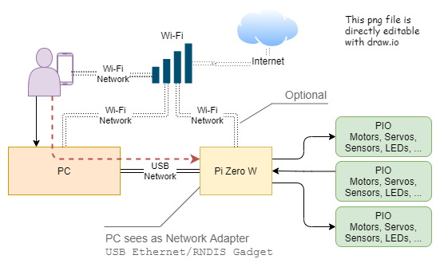
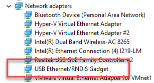

This script configures a freshly created Raspberry Pi bootable SD card to appear as private network when plugged into a computer over USB.  This means you can get full network connectivity and tooling for working with a Raspberry Pi that would not otherwise be on a network.



# Usage
1. It configures the Pi's USB as OTG
1. It makes the Pi appear a USB based network adapter with the Pi as the other device on the network.  This is sometimes referred to as a _Network Gadget_ mode.
1. It enables SSH so you can ssh in over the USB connection or over wifi
1. It _optionally_ configures the wi-fi for a specific network

`Enable-Ethernet-Gadget -PIBootDrive F: -NetworkName my-ssid -NetworkPassord my-network-password`
* `PIBootDrive` The Drive letter for the SD card boot partition _Defaults to F:_
* `NetworkName` The SSID of your wireless network
* `NetworkPassword`  The wireless network password

`NetworkName` and `NetworkPassword` are _optional_ parameters. Both are _required_ if either are specified.

# Configuring the Pi as a USB ethernet device
## Steps
1. Run the script
1. Eject the card and insert into Raspberry Pi Zero
1. Plug the _USB_ port into your computer.
1. Plug a power adapter into the _POWER_ port on the Raspberry Pi Zero
1. You should see `USB Ethernet/RNDIS Gadget` in the _Device Manager_ control panel
    * 
1. `ping raspberrypi.local`
    ```
    PS C:\pi-zero-ethernet-gadget> ping raspberrypi.local
    Pinging raspberrypi.local [fe80::d31c:3ca4:a4b6:895f%61] with 32 bytes of data:
    Reply from fe80::d31c:3ca4:a4b6:895f%61: time=1ms
    Reply from fe80::d31c:3ca4:a4b6:895f%61: time<1ms
    Reply from fe80::d31c:3ca4:a4b6:895f%61: time<1ms
    Reply from fe80::d31c:3ca4:a4b6:895f%61: time<1ms
    ```
    
## Verify over the USB connection
1. SSH to the device it is known as `raspberrypi.local` The default username is `pi` and the default password is `raspberry'
    * Using the linux WSL command prompt `ssh pi@raspberrypi.local`
    * Using Putty... _to be added_

## Verifying wifi (optional)
1. SSH into the device
1. run `ifconfig wlan0` and verify the IP address is from your network.  
    * A `169.x.y.z` address means it did not work.

# Troubleshooting
## Enabling Powershell scripts

You may have enable powershell scripts from an _elevated_ prompt
  `set-executionpolicy remotesigned`

## Enabling Debug Output

* Enable debug out put with
  *   `$DebugPreference = "Continue"`
* Disable debug with
  *  `$DebugPreference = "SilentlyContinue"`
* Supposedly you can temporarily enable deebug outwith but I never got it to work: -Debug

# Related Sites
* Install Raspberry Pi OS using [Raspberry Pi Imager](https://www.raspberrypi.org/software/)
* [This site](https://medium.com/@aallan/setting-up-a-headless-raspberry-pi-zero-3ded0b83f274) provided the basis for this script

# Known Issues
1. Hard coded country code is 'US'
